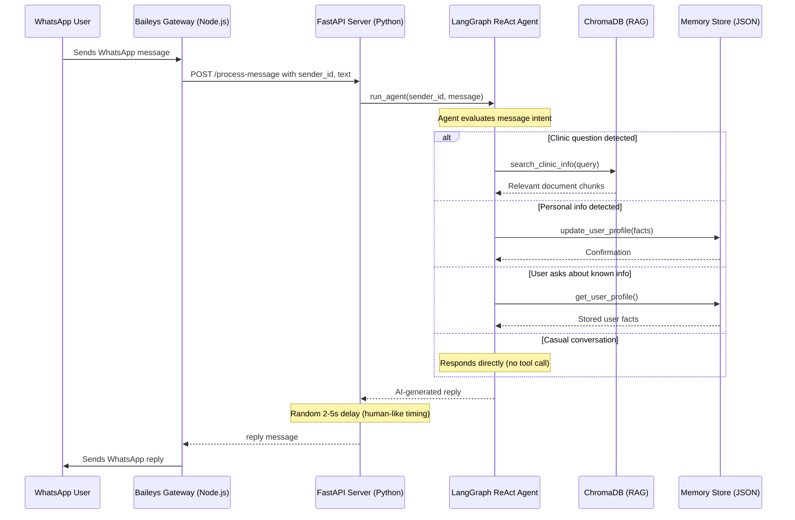
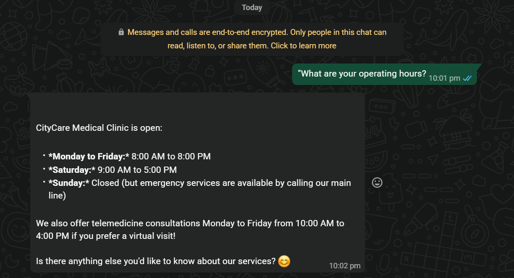
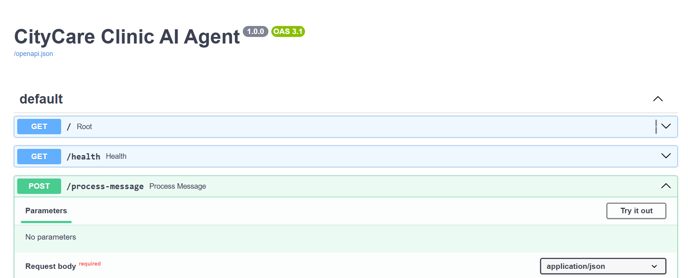

---

# Table of Contents

- [Overview](#-overview)
- [Key Features](#-key-features)
- [Architecture](#-architecture)
  - [High-Level Design](#high-level-design)
  - [Component Interaction Diagram](#component-interaction-diagram)
- [Tech Stack](#-tech-stack)
- [Project Structure](#-project-structure)
- [Module Breakdown](#-module-breakdown)
  - [AI Core (Python)](#1-ai-core-python--the-brain)
  - [WhatsApp Gateway (Node.js)](#2-whatsapp-gateway-nodejs--the-hands)
- [End-to-End Workflow](#-end-to-end-workflow)
- [Screenshots](#-screenshots)
- [Getting Started](#-getting-started)
  - [Prerequisites](#prerequisites)
  - [Installation](#installation)
  - [Configuration](#configuration)
  - [Running the Project](#running-the-project)
- [API Reference](#-api-reference)
- [How RAG Works in This Project](#-how-rag-works-in-this-project)
- [Two-Tier Memory System](#-two-tier-memory-system)
- [Why Microservices over a Monolith](#-why-microservices-over-a-monolith)
- [Future Improvements](#-future-improvements)
---

## 🔍 Overview

**CityCare Clinic WhatsApp AI Agent** is a production-ready AI receptionist that runs directly on WhatsApp. It answers patient questions about clinic services, hours, pricing, and policies by retrieving accurate information from a custom knowledge base using **Retrieval-Augmented Generation (RAG)**. Beyond simple Q&A, it remembers each patient's personal details across conversations through a **two-tier memory system**, delivering a personalized experience without any manual data entry.

The system is built as a **polyglot microservices architecture**, with the AI reasoning layer (Python/LangChain) and the messaging gateway (Node.js/Baileys) running as independent services connected via a REST API. This separation makes the system resilient, maintainable, and independently scalable.

---

## ✨ Key Features

| Feature                            | Description                                                                                                                      |
| ---------------------------------- | -------------------------------------------------------------------------------------------------------------------------------- |
| **RAG-Powered Q&A**                | Answers clinic-specific questions by searching a vectorized knowledge base, not by hallucinating.                                |
| **Persistent User Memory**         | Remembers patient names, ages, preferences, and personal facts across sessions using a JSON-backed profile store.                |
| **Short-Term Conversation Buffer** | Maintains the last 10 messages per user for fluid, context-aware dialogue.                                                       |
| **Agentic Tool Use**               | Uses a LangGraph ReAct agent that autonomously decides when to search the knowledge base, update a user profile, or simply chat. |
| **Auto-Reconnecting Gateway**      | The Baileys WebSocket gateway automatically reconnects after network drops, keeping the bot online 24/7.                         |
| **Human-Like Response Timing**     | Introduces a randomized 2–5 second delay before replying to simulate natural typing speed and avoid detection.                   |
| **Swagger API Docs**               | The FastAPI server auto-generates interactive API documentation at`/docs` for testing and debugging.                             |
| **Graceful Error Handling**        | If the AI server is offline, the gateway sends a user-friendly error message instead of crashing.                                |

---

## 🏗 Architecture

### High-Level Design

The system follows a **polyglot microservices architecture** (also called "The Polyglot Bridge") with three distinct layers:

```
┌─────────────────────────────────────────────────────────────────────┐
│                         SYSTEM ARCHITECTURE                         │
├─────────────────────────────────────────────────────────────────────┤
│                                                                     │
│  ┌───────────────────────────────────────────────────────────────┐  │
│  │               AI REASONING LAYER  (Python)                    │  │
│  │                                                               │  │
│  │   ┌─────────────────┐    ┌──────────────────────────────┐     │  │
│  │   │   Vector Store  │◄───│     LangGraph ReAct Agent    │     │  │
│  │   │  (ChromaDB RAG) │───►│    (Core Orchestrator)       │     │  │
│  │   └─────────────────┘    └──────┬──────────┬────────────┘     │  │
│  │         Tool: RAG Query         │          │                  │  │
│  │                          Conversation   Tool: Update          │  │
│  │                                 │       User Facts            │  │
│  │   ┌─────────────────┐     ┌──────▼──┐  ┌──▼──────────────┐    │  │
│  │   │  Short-Term Mem │◄──► │ Buffer  │  │  Long-Term Mem  │    │  │
│  │   │  (Chat History) │     │ (10msg) │  │ (User Profiles) │    │  │
│  │   └─────────────────┘     └─────────┘  └─────────────────┘    │  │
│  │                                                               │  │
│  └───────────────────────────────────────────────────────────────┘  │
│                              ▲                                      │
│                    REST API  │  POST /process-message               │
│                    (HTTP)    │  { sender_id, text }                 │
│                              │                                      │
│  ┌───────────────────────────┴───────────────────────────────────┐  │
│  │              WHATSAPP LAYER  (Node.js)                        │  │
│  │                                                               │  │
    │  │   ┌──────────────────┐    ┌──────────────────────────────┐    │  │
│  │   │  Baileys Gateway │◄──►│    Main Controller           │    │  │
│  │   │  (WebSocket)     │    │  (Session Manager)           │    │  │
│  │   └────────┬─────────┘    └──────────────────────────────┘    │  │
│  │            │                                                  │  │
│  │            ▼                                                  │  │
│  │   ┌─────────────────┐                                         │  │
│  │   │  WhatsApp User  │                                         │  │
│  │   │  (Mobile App)   │                                         │  │
│  │   └─────────────────┘                                         │  │
│  └───────────────────────────────────────────────────────────────┘  │
└─────────────────────────────────────────────────────────────────────┘
```

### Component Interaction Diagram



---

## 🧰 Tech Stack

### AI Core (Python)

| Technology                 | Purpose                                                                                        |
| -------------------------- | ---------------------------------------------------------------------------------------------- |
| **Python 3.11+**           | Primary language for all AI logic                                                              |
| **FastAPI**                | High-performance async REST API server                                                         |
| **Uvicorn**                | ASGI server to run FastAPI                                                                     |
| **LangChain**              | Framework for chaining LLM calls, tools, and prompts                                           |
| **LangGraph**              | Stateful agent orchestration with the ReAct pattern                                            |
| **ChromaDB**               | Local vector database for storing and searching document embeddings                            |
| **HuggingFace Embeddings** | `sentence-transformers/all-MiniLM-L6-v2` for generating text embeddings locally (no API calls) |
| **OpenAI-compatible LLM**  | Proxied through a local FreeLLM endpoint (`gpt-4o-mini`)                                       |
| **Pydantic**               | Request/response schema validation                                                             |
| **python-dotenv**          | Environment variable management                                                                |

### WhatsApp Gateway (Node.js)

| Technology                  | Purpose                                                           |
| --------------------------- | ----------------------------------------------------------------- |
| **Node.js 20+**             | Runtime for the WhatsApp connection layer                         |
| **@whiskeysockets/baileys** | WhatsApp Web API client using WebSockets (no official API needed) |
| **axios**                   | HTTP client for communicating with the Python AI server           |
| **qrcode-terminal**         | Renders QR codes in the terminal for WhatsApp authentication      |
| **pino**                    | High-performance JSON logger                                      |
| **dotenv**                  | Shared`.env` configuration loading                                |

### Infrastructure & Storage

| Technology          | Purpose                                                       |
| ------------------- | ------------------------------------------------------------- |
| **ChromaDB**        | Persistent vector store at`./data/chroma_db`                  |
| **JSON File**       | Lightweight long-term user memory at`./data/user_memory.json` |
| **REST API (HTTP)** | Inter-service communication between Node.js and Python        |

---

## 📁 Project Structure

```
Task_No_06/
│
├── .env                          # Shared environment variables (LLM keys, ports, paths)
├── .gitignore                    # Excludes .venv, node_modules, data/, auth_info/
├── README.md                     # This file
│
├── ai_core/                      # ═══ PYTHON AI LAYER ═══
│   ├── __init__.py               # Package marker
│   ├── main.py                   # FastAPI server — exposes /process-message endpoint
│   ├── agent.py                  # LangGraph ReAct agent with tool definitions
│   ├── rag.py                    # RAG pipeline — ingestion, embedding, vector search
│   ├── memory.py                 # Two-tier memory — UserMemoryStore + ConversationBuffer
│   ├── ingest.py                 # Standalone script to ingest knowledge base into ChromaDB
│   └── knowledge_base/
│       └── clinic_info.md        # Source document — all clinic facts, services, pricing
│
├── whatsapp_gateway/             # ═══ NODE.JS WHATSAPP LAYER ═══
│   ├── index.js                  # Baileys WebSocket client with auto-reconnect
│   ├── package.json              # Node.js dependencies
│   ├── package-lock.json         # Dependency lock file
│   ├── auth_info/                # WhatsApp session credentials (gitignored)
│   └── baileys.log               # Connection logs (gitignored)
│
├── data/                         # ═══ PERSISTENT STORAGE ═══ (gitignored)
│   ├── chroma_db/                # ChromaDB vector store files
│   └── user_memory.json          # Long-term user profile store
│
└── images/                       # ═══ SCREENSHOTS ═══
    ├── botreply.png              # WhatsApp conversation showing RAG response
    └── roots.png                 # FastAPI Swagger UI (API documentation)
```

---

## 🧩 Module Breakdown

### 1. AI Core (Python) — The Brain

#### `main.py` — FastAPI Server

The entry point for the AI service. Starts a FastAPI server that:

- Auto-ingests the knowledge base into ChromaDB on first startup
- Exposes `POST /process-message` accepting `{sender_id, text}` and returning `{reply}`
- Provides a health check at `GET /health`
- Redirects the root `/` to the interactive Swagger docs

#### `agent.py` — LangGraph ReAct Agent

The core intelligence module. Contains:

- **Three agent tools:**
  - `search_clinic_info` — queries the ChromaDB vector store for clinic-related answers
  - `update_user_profile` — stores personal facts (name, age, city, etc.) in the user's profile
  - `get_user_profile` — retrieves everything the bot remembers about the current user
- **Personal info detector** (`_detect_personal_info`) — a rule-based parser that extracts structured facts from natural language (e.g., "My name is Nouman" → `{"name": "Nouman"}`)
- **System prompt** — instructs the LLM to act as a CityCare clinic assistant with specific behavioral guidelines
- **Human-like delay** — a random 2–5 second sleep before returning, simulating realistic response timing

#### `rag.py` — RAG Pipeline

Handles the full Retrieval-Augmented Generation pipeline:

- **Ingestion:** loads `.md` files from `knowledge_base/`, splits them into 500-character chunks with 80-character overlap using `RecursiveCharacterTextSplitter`, embeds them with HuggingFace `all-MiniLM-L6-v2`, and stores them in ChromaDB
- **Search:** performs similarity search over the vector store, returning the top 3 most relevant chunks for any query

#### `memory.py` — Two-Tier Memory System

Implements persistent memory with two complementary stores:

- **`UserMemoryStore`** (Tier 2 — Long-Term): a JSON-file-backed store keyed by user ID (WhatsApp phone number). Stores structured facts like name, age, profession, city, and preferences. Persists across server restarts.
- **`ConversationBuffer`** (Tier 1 — Short-Term): an in-memory ring buffer holding the last 10 messages per user. Provides conversational context so the agent can reference recent dialogue.

#### `ingest.py` — Standalone Ingestion Script

A convenience script to manually re-ingest the knowledge base into ChromaDB without starting the full server.

#### `knowledge_base/clinic_info.md` — Source Document

A comprehensive Markdown file containing all of CityCare Medical Clinic's business information: services (General Medicine, Pediatrics, Cardiology, Dermatology, Orthopedics, Women's Health, Lab/Diagnostics), pricing, insurance plans, operating hours, telemedicine details, pharmacy info, emergency protocols, and FAQs.

---

### 2. WhatsApp Gateway (Node.js) — The Hands

#### `index.js` — Baileys WebSocket Client

The messaging layer that handles all WhatsApp connectivity:

- Establishes a WebSocket connection to WhatsApp using `@whiskeysockets/baileys`
- Displays a QR code in the terminal for first-time authentication
- Persists session credentials in `auth_info/` for automatic re-authentication
- Listens for incoming messages via the `messages.upsert` event
- Forwards each message to the Python AI server via `POST /process-message`
- Sends the AI's response back to the WhatsApp user
- Implements **auto-reconnect** with a 5-second delay on connection drops (unless logged out)
- Handles **graceful shutdown** on SIGINT (Ctrl+C)

---

## 🔄 End-to-End Workflow

Here is the complete step-by-step flow when a patient sends a message:

```
Step 1: INCOMING MESSAGE
════════════════════════════════════════════════════════════════════
Patient sends "What are your operating hours?" on WhatsApp
                        │
                        ▼
Step 2: GATEWAY RECEIVES
════════════════════════════════════════════════════════════════════
Baileys WebSocket captures the messages.upsert event
  → Extracts: sender JID (phone number) + message text
  → Ignores: self-sent messages, empty messages, media
                        │
                        ▼
Step 3: HTTP BRIDGE
════════════════════════════════════════════════════════════════════
Gateway sends POST to Python server:
  POST http://0.0.0.0:8000/process-message
  Body: { "sender_id": "923xxxxxxxxx@s.whatsapp.net",
          "text": "What are your operating hours?" }
                        │
                        ▼
Step 4: PERSONAL INFO DETECTION
════════════════════════════════════════════════════════════════════
agent.py runs _detect_personal_info() on the raw text
  → Scans for patterns like "my name is", "I live in", etc.
  → If found → immediately saves to user_memory.json
  → For this query → no personal info detected → skip
                        │
                        ▼
Step 5: CONTEXT ASSEMBLY
════════════════════════════════════════════════════════════════════
Builds the agent's input:
  → Fetches last 5 messages from ConversationBuffer (short-term memory)
  → Constructs system prompt with:
      • Clinic assistant persona
      • Detected personal info context (if any)
      • Recent conversation history
                        │
                        ▼
Step 6: AGENT REASONING (ReAct Loop)
════════════════════════════════════════════════════════════════════
LangGraph ReAct agent receives the message and decides:
  → "This is a clinic-related question"
  → Action: call search_clinic_info("operating hours")
                        │
                        ▼
Step 7: RAG RETRIEVAL
════════════════════════════════════════════════════════════════════
ChromaDB similarity search:
  → Embeds "operating hours" using all-MiniLM-L6-v2
  → Finds top 3 matching chunks from clinic_info.md
  → Returns: operating hours, telemedicine hours, etc.
                        │
                        ▼
Step 8: RESPONSE GENERATION
════════════════════════════════════════════════════════════════════
Agent synthesizes the retrieved chunks into a natural reply:
  "CityCare Medical Clinic is open:
   • Monday to Friday: 8:00 AM to 8:00 PM
   • Saturday: 9:00 AM to 5:00 PM
   • Sunday: Closed (emergency services available)
   We also offer telemedicine Mon-Fri 10AM-4PM!"
                        │
                        ▼
Step 9: MEMORY UPDATE
════════════════════════════════════════════════════════════════════
  → Saves user message + assistant reply to ConversationBuffer
  → Random 2-5 second delay (human-like timing)
                        │
                        ▼
Step 10: DELIVERY
════════════════════════════════════════════════════════════════════
  → Python server returns { "reply": "..." }
  → Gateway calls sock.sendMessage(sender, { text: reply })
  → Patient receives the answer on WhatsApp ✓
```

---

## 📸 Screenshots

### WhatsApp Bot in Action — RAG Response

The bot accurately retrieves operating hours from the knowledge base when a patient asks:

<p align="center">
  
</p>

### FastAPI Swagger UI — API Documentation

The interactive API documentation auto-generated by FastAPI, showing all available endpoints:

<p align="center">
  
</p>

---

## 🚀 Getting Started

### Prerequisites

- **Python 3.11+** with `pip`
- **Node.js 20+** with `npm`
- A **WhatsApp account** (for QR code scanning)
- An **OpenAI-compatible LLM endpoint** (or the FreeLLM API proxy)

### Installation

**1. Clone the repository:**

```bash
git clone <repository-url>
cd Task_No_06
```

**2. Set up the Python AI Core:**

```bash
python -m venv .venv

# Windows
.venv\Scripts\activate
# macOS/Linux
source .venv/bin/activate

pip install fastapi uvicorn langchain langchain-openai langgraph langchain-chroma langchain-huggingface langchain-text-splitters langchain-community python-dotenv pydantic sentence-transformers chromadb
```

**3. Set up the WhatsApp Gateway:**

```bash
cd whatsapp_gateway
npm install
cd ..
```

### Configuration

Create a `.env` file in the project root with the following variables:

```env
# LLM Provider
OPENAI_API_KEY=your-api-key-here
OPENAI_BASE_URL=http://127.0.0.1:31415/v1
OPENAI_MODEL_NAME=gpt-4o-mini

# Embeddings (runs locally, no API key needed)
EMBEDDING_MODEL=sentence-transformers/all-MiniLM-L6-v2

# Server config
AI_SERVER_HOST=0.0.0.0
AI_SERVER_PORT=8000

# Storage paths
CHROMA_DB_PATH=./data/chroma_db
USER_MEMORY_PATH=./data/user_memory.json
```

### Running the Project

You need **two terminals** running simultaneously:

**Terminal 1 — Start the AI Server:**

```bash
python ai_core/main.py
```

The server will:

- Ingest the knowledge base on first run (if ChromaDB is empty)
- Start listening on `http://0.0.0.0:8000`
- Interactive docs available at `http://localhost:8000/docs`

**Terminal 2 — Start the WhatsApp Gateway:**

```bash
cd whatsapp_gateway
node index.js
```

On first run:

- A QR code will appear in the terminal
- Scan it with WhatsApp (Settings → Linked Devices → Link a Device)
- Once connected, the bot is live and will respond to incoming messages

---

## 📡 API Reference

| Method | Endpoint           | Description               | Request Body                          | Response           |
| ------ | ------------------ | ------------------------- | ------------------------------------- | ------------------ |
| `GET`  | `/`                | Redirects to Swagger docs | —                                     | `302` → `/docs`    |
| `GET`  | `/health`          | Health check              | —                                     | `{"status": "ok"}` |
| `POST` | `/process-message` | Process a user message    | `{"sender_id": "str", "text": "str"}` | `{"reply": "str"}` |

### Example Request

```bash
curl -X POST http://localhost:8000/process-message \
  -H "Content-Type: application/json" \
  -d '{"sender_id": "923001234567@s.whatsapp.net", "text": "What are your services?"}'
```

---

## 📚 How RAG Works in This Project

```
 clinic_info.md                    ChromaDB
┌──────────────┐    Chunking     ┌──────────────────┐
│  4,753 bytes │───────────────► │  ~20 chunks      │
│  of clinic   │  500 chars ea.  │  each embedded as│
│  information │  80 overlap     │  384-dim vector  │
└──────────────┘                 └────────┬─────────┘
                                          │
             User Query                   │  Similarity
        "What are your fees?"             │  Search (top 3)
                │                         │
                ▼                         ▼
        ┌───────────────┐        ┌───────────────-┐
        │ Embed query   │───────►│ Return chunks  │
        │ (MiniLM-L6)   │        │ about pricing  │
        └───────────────┘        └───────-┬───────┘
                                          │
                                          ▼
                                 ┌───────────────┐
                                 │ LLM generates │
                                 │ natural reply │
                                 └───────────────┘
```

The RAG pipeline never generates answers from thin air. Every clinic-related response is grounded in the actual content of `clinic_info.md`, which means the bot will not hallucinate fake prices, hours, or services.

---

## 🧠 Two-Tier Memory System

```
┌─────────────────────────────────────────────────────┐
│                   MEMORY ARCHITECTURE               │
├──────────────────────┬──────────────────────────────┤
│    TIER 1            │    TIER 2                    │
│    Short-Term        │    Long-Term                 │
├──────────────────────┼──────────────────────────────┤
│ • Last 10 messages   │ • Persistent user facts      │
│ • In-memory only     │ • JSON file on disk          │
│ • Per-user buffer    │ • Keyed by phone number      │
│ • Lost on restart    │ • Survives server restarts   │
│                      │                              │
│ Purpose:             │ Purpose:                     │
│ Maintain flow of     │ Remember "My name is Nouman" │
│ current conversation │ even after 100+ messages     │
└──────────────────────┴──────────────────────────────┘
```

**Why two tiers?** Standard LLM memory (just feeding recent messages) eventually forgets important facts as they scroll out of the context window. The long-term store ensures that personal details persist indefinitely, while the short-term buffer keeps recent conversation context for natural dialogue flow.

---

## ⚖ Why Microservices over a Monolith

| Microservices (This Project)                                                      | Monolith (Alternative)                          |
| --------------------------------------------------------------------------------- | ----------------------------------------------- |
| **Separation of Concerns** — a WhatsApp disconnect does not crash the AI server   | One error can bring down the entire application |
| **Language Best-in-Class** — Node.js for real-time WebSockets, Python for AI/ML   | Forced to compromise on one language            |
| **Independent Scaling** — the AI server and gateway can run on separate machines  | Difficult to scale individual components        |
| **Easier Debugging** — each layer can be tested and debugged in isolation         | Tangled logic makes debugging a nightmare       |
| **Resume Value** — demonstrates system design and distributed architecture skills | Shows scripting ability, not system design      |

---

## 🔮 Future Improvements

- [ ] **Replace JSON memory with SQLite/PostgreSQL** for production-grade persistence
- [ ] **Add appointment booking tool** so the agent can schedule visits directly
- [ ] **Multi-language support** (Urdu, Arabic) for a broader patient base
- [ ] **Voice message transcription** using Whisper to handle audio messages
- [ ] **Admin dashboard** for clinic staff to monitor conversations and override responses
- [ ] **Rate limiting** to prevent abuse and manage LLM API costs
- [ ] **Docker Compose** for one-command deployment of both services
- [ ] **Webhook-based architecture** to replace polling for higher throughput

---


